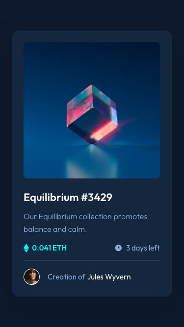

# Frontend Mentor - NFT preview card component solution

This is a solution to the [NFT preview card component challenge on Frontend Mentor](https://www.frontendmentor.io/challenges/nft-preview-card-component-SbdUL_w0U). Frontend Mentor challenges help you improve your coding skills by building realistic projects. 

### The challenge

The challenge is to build out this NFT preview card compoent and get it looking as close to the design as possible.

Users should be able to:

- View the optimal layout depending on their device's screen size
- See hover states for interactive elements

### Screenshot

### Links

- Solution URL: [Solution](./solution/)
- Live Site URL: [Live site](https://your-live-site-url.com)

### Built with

- Semantic HTML5 markup
- CSS custom properties
- Flexbox

## Author

- Website - [GitHub Pages](https://danielw720.github.io/)
- Frontend Mentor - [@DanielW720](https://www.frontendmentor.io/profile/yourusername)
- LinkedIn - [Daniel Westerlund](https://www.linkedin.com/in/daniel-westerlund-a07529179/)
